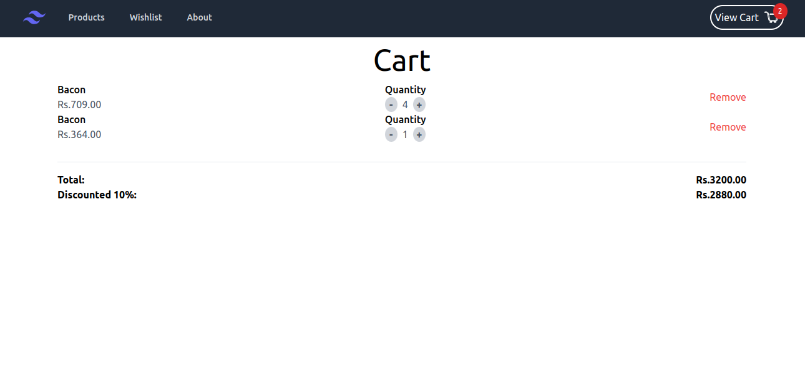
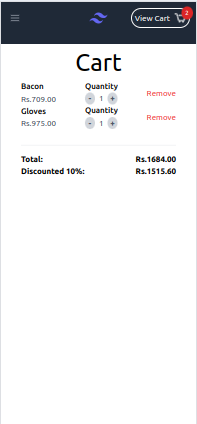

# [Guvi-Task-6_Route-Add-To-Cart](https://guvi-task-6-route-add-to-cart.vercel.app/)

## Following steps explains about the Shopping cart app with routes 
-  After the app loads, mock product data are fetched.
-  Fetched Data will are displayed in Product page/landing page as lists of cards.
-  Card displays key information of the product image, product name, price and add to cart button.
-  When 'add to cart' button is clicked it will be added to shopping cart.
-  Shopping cart page can be opened by clicking 'View cart' button in Nav bar, which list the added items.
-  Cart icon also shows total number products in the shopping cart.
-  If same item is tried to add again to cart, a alert message will display where there item is already exists in cart.
-  Added item in the cart can be removed by clicking remove button of the corresponding product.
-  Total price and discount price also displayed in shopping cart.
-  Total Price gets updated if quantity value is changed.
- 

## Techologies used in the project
- React
- Tailwind CSS

## Screenshot
 
### Desktop 
 

### Mobile view

